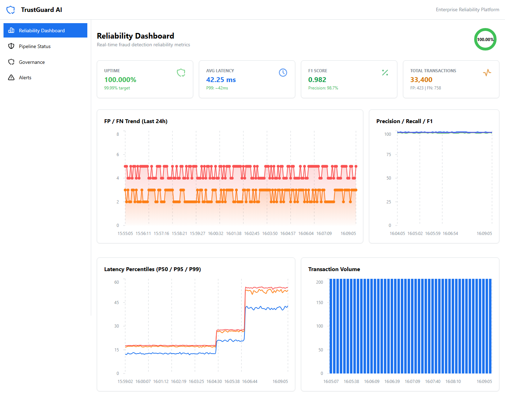
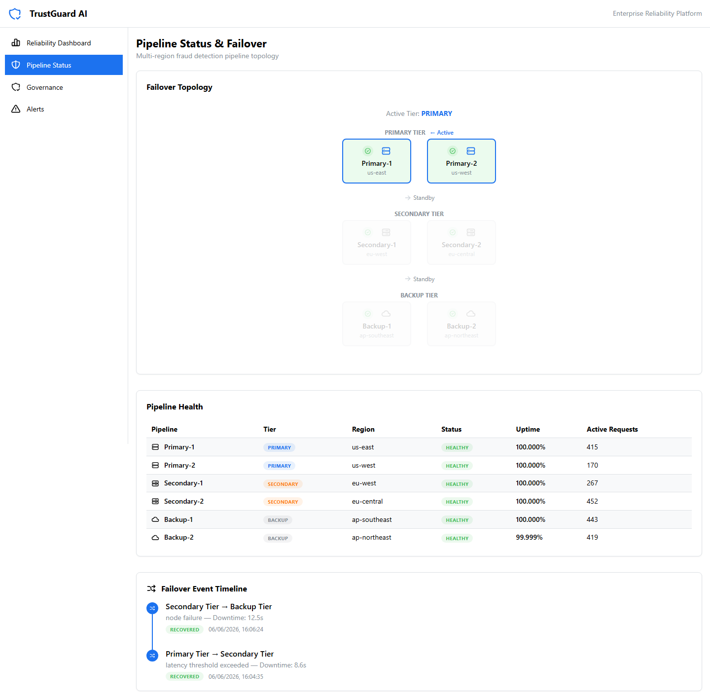
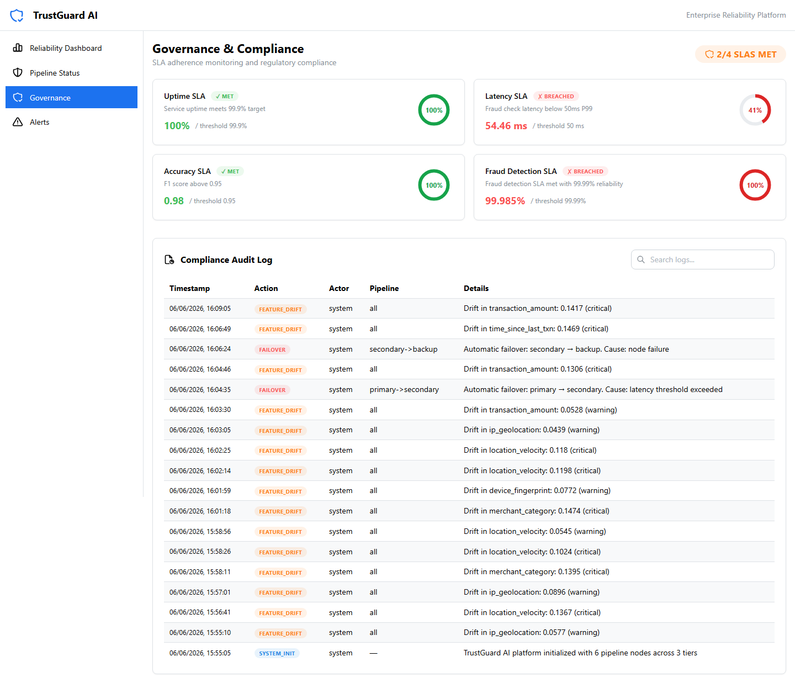
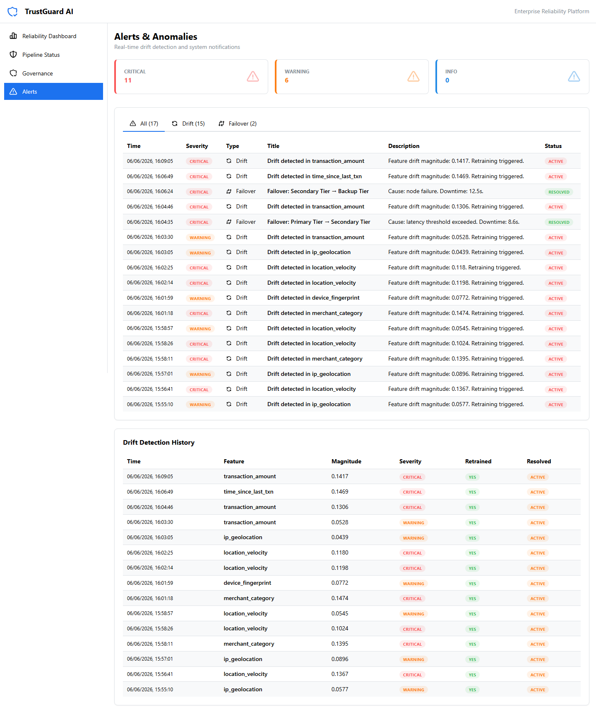

# TrustGuard AI — Reliability Platform for Fraud Detection Systems

A full-stack application demonstrating **high availability**, **consistency**, and **resilience** in AI-driven fraud detection pipelines. TrustGuard AI simulates a multi-region, multi-tier fraud detection infrastructure with automatic failover, real-time reliability metrics, drift detection, and SLA governance.

## Executive Positioning

| Pillar | Impact |
|--------|--------|
| **Business Impact** | Protects revenue streams and customer trust through uninterrupted fraud monitoring |
| **Risk Mitigation** | Reduces exposure to fraud losses and reputational damage via adaptive models and automatic failover |
| **Governance** | Demonstrates reliability as a measurable KPI for enterprise AI systems |

## Architecture

```
┌─────────────────────────────────────────────────────────────────┐
│                        TrustGuard AI                            │
├────────────────────┬──────────────────────┬─────────────────────┤
│   Primary Tier     │   Secondary Tier     │    Backup Tier      │
│   ┌──────────┐    │   ┌──────────┐       │   ┌──────────┐     │
│   │Primary-1 │    │   │Second-1  │       │   │Backup-1  │     │
│   │us-east   │────┼──▶│eu-west   │───────┼──▶│ap-southeast    │
│   └──────────┘    │   └──────────┘       │   └──────────┘     │
│   ┌──────────┐    │   ┌──────────┐       │   ┌──────────┐     │
│   │Primary-2 │    │   │Second-2  │       │   │Backup-2  │     │
│   │us-west   │    │   │eu-central│       │   │ap-northeast   │
│   └──────────┘    │   └──────────┘       │   └──────────┘     │
└─────────┬─────────┴──────────┬───────────┴─────────┬───────────┘
          │                    │                      │
          └───────── /api/* ───┼──────────────────────┘
                              │
                    ┌─────────▼──────────┐
                    │    FastAPI +        │
                    │  SQLite / Async     │
                    └─────────┬──────────┘
                              │
                    ┌─────────▼──────────┐
                    │  React + Mantine   │
                    │  Port 5173         │
                    └────────────────────┘
```

## Tech Stack

| Layer | Technology |
|-------|-----------|
| **Frontend** | React 18, TypeScript, Vite 6, Mantine UI 7, @mantine/charts (Recharts), React Router 7 |
| **Backend** | Python 3.12+, FastAPI 0.136, SQLAlchemy 2.0 (async), AIOSQLite, Pydantic 2, NumPy |
| **Database** | SQLite (zero-config, file-based) |
| **Tools** | UV (Python package manager), npm |

## Core Features

### High Availability
- **3-tier redundant pipeline**: Primary → Secondary → Backup across 6 geographic regions (us-east, us-west, eu-west, eu-central, ap-southeast, ap-northeast)
- **Automatic failover**: When a tier degrades or fails, traffic seamlessly shifts to the next available tier
- **Continuous uptime monitoring**: Each pipeline node reports real-time uptime percentage and active request count

### Consistency & Trust
- **Real-time reliability metrics**: Precision, recall, F1 score tracked every 5 seconds
- **False positive / false negative monitoring**: Continuous tracking of misclassifications with trend visualization
- **Latency percentiles**: P50, P95, P99 latency for fraud checks

### Resilience
- **Adaptive model retraining**: Drift detection triggers automatic model retraining when F1 score deviates from baseline
- **Feature drift monitoring**: 6 feature dimensions monitored (transaction_amount, location_velocity, device_fingerprint, ip_geolocation, merchant_category, time_since_last_txn)
- **Real-time alerting**: Critical/warning/info alerts for drift events, failover events, and anomalies

## Data Model

7 tables managed by SQLAlchemy ORM:

| Table | Purpose |
|-------|---------|
| `pipeline_health` | Per-pipeline node status, tier, region, uptime %, active requests |
| `reliability_metrics` | Time-series: uptime, latency (P50/P95/P99), precision, recall, F1, FP, FN |
| `failover_events` | Failover history with cause, duration, recovery status |
| `drift_events` | Detected drift: feature name, magnitude, severity, retraining trigger |
| `sla_badges` | SLA definitions: name, threshold, current value, met/breached status |
| `audit_logs` | Compliance trail: action, actor, pipeline, details with timestamps |

## Simulation Engine

The backend runs a **background simulation loop** (every 5 seconds) that:

1. **Generates realistic transaction metrics** — Simulates 200 transactions per tick with configurable fraud rates, latency distributions, and accuracy variance
2. **Injects drift events** (~8% probability per tick) — Randomly selects a feature dimension and generates drift with warning or critical severity
3. **Simulates pipeline outages** (~4% probability per tick) — Triggers automatic failover from primary → secondary → backup tiers with realistic causes (latency threshold, node failure, network partition, resource exhaustion, DB timeout)
4. **Monitors F1 drift** — Compares rolling window of recent F1 scores against baseline using statistical thresholding (3-sigma)
5. **Updates SLA badges** — Live status for Uptime SLA (99.9%), Latency SLA (50ms P99), Accuracy SLA (F1 > 0.95), Fraud Detection SLA (99.99% reliability)
6. **Writes audit logs** — Every failover, drift detection, and SLA check creates an audit trail entry

## Backend API

All endpoints are prefixed with `/api`.

### Health

| Method | Path | Description |
|--------|------|-------------|
| GET | `/api/health` | Health check, returns `{"status": "ok", "app": "TrustGuard AI"}` |

### Reliability

| Method | Path | Description |
|--------|------|-------------|
| GET | `/api/reliability/metrics?hours=24` | Time-series reliability metrics (uptime, latency, F1, FP, FN) |
| GET | `/api/reliability/summary` | Aggregated dashboard summary (current uptime, avg latency, avg F1, totals) |

### Pipelines

| Method | Path | Description |
|--------|------|-------------|
| GET | `/api/pipelines/health` | All pipeline nodes with status, uptime, region, active requests |
| GET | `/api/pipelines/topology` | Tier-grouped pipeline topology with active tier detection |
| GET | `/api/pipelines/failovers?hours=72` | Failover event history with cause and duration |

### Governance

| Method | Path | Description |
|--------|------|-------------|
| GET | `/api/governance/sla-badges` | All SLA badges with current values and met/breached status |
| GET | `/api/governance/audit-logs?hours=168` | Compliance audit log entries with searchable details |

### Alerts

| Method | Path | Description |
|--------|------|-------------|
| GET | `/api/alerts/drift?hours=168` | Drift detection event history |
| GET | `/api/alerts/feed?hours=72` | Unified alert feed combining drift and failover events |

### Backend Project Structure
```
backend/
  app/
    main.py                    — FastAPI app, CORS, lifespan with simulation loop
    config.py                  — Pydantic Settings (database URL, CORS origins, simulation interval)
    database.py                — Async SQLAlchemy engine, session factory, init_db
    models.py                  — 7 ORM models (SQLAlchemy)
    schemas.py                 — Pydantic request/response models
    simulation/
      fraud_pipeline.py        — 3-tier pipeline simulator (6 nodes, transaction generation)
      metrics_engine.py        — Background tick loop orchestrating all simulation
      drift_detector.py        — F1 drift detection + feature drift injection
      failover_manager.py      — Outage simulation and failover trigger logic
    routes/
      reliability.py           — /api/reliability/*
      pipelines.py             — /api/pipelines/*
      governance.py            — /api/governance/*
      alerts.py                — /api/alerts/*
  scripts/
    seed_data.py               — Seeds 7 days of historical metrics + sample audit logs
```

## Frontend

4 pages, navigated via sidebar navigation:

### Reliability Dashboard (`/`)
- **4 MetricCards**: Uptime %, Avg Latency, F1 Score, Total Transactions with live trend indicators
- **Uptime RingProgress**: Header visualization with color-coded SLA attainment
- **FP / FN Area Chart**: Stacked area showing false positive and false negative trends over 24 hours
- **Precision / Recall / F1 Line Chart**: Multi-line chart with the last 60 data points
- **Latency Percentiles Chart**: P50 / P95 / P99 line chart tracking response time distribution
- **Transaction Volume Bar Chart**: Recent transaction count visualization



### Pipeline Status (`/pipelines`)
- **Failover Topology Diagram**: Visual 3-tier pipeline layout with:
  - Active tier highlighting with green/red status indicators
  - Pipeline nodes showing name, region, and health status
  - Directional arrows indicating current failover path
  - Tooltips with detailed per-pipeline metrics
- **Pipeline Health Table**: All 6 nodes with tier badge, region, status badge, uptime %, active requests
- **Failover Event Timeline**: Chronological list of failover events with cause, duration, and recovery status



### Governance (`/governance`)
- **SLA Badge Cards**: 4 SLA badges (Uptime, Latency, Accuracy, Fraud Detection) each showing:
  - Name with met/breached badge
  - Description and threshold target
  - Current value versus threshold
  - RingProgress visualization
- **Compliance Audit Log**: Searchable table with timestamp, action badge, actor, pipeline, and details
- **SLA summary badge**: Met count / total count in header



### Alerts (`/alerts`)
- **Severity Summary Cards**: Critical / Warning / Info counts with color-coded borders
- **Tabbed Alert Filter**: All / Drift / Failover tabs with count badges
- **Alert Table**: Time, severity badge, type icon, title, description, resolved/active status
- **Drift Detection History**: Separate table below with feature name, magnitude, severity, retraining trigger, resolution status



### Frontend Project Structure
```
frontend/
  src/
    main.tsx                   — Entry point, MantineProvider, BrowserRouter
    App.tsx                    — AppShell layout, sidebar nav, 4 routes, ErrorBoundary
    theme.ts                   — Mantine theme customization (trust palette, severity colors)
    global.css                 — Base CSS reset
    api/
      client.ts                — Fully typed fetch API client with all endpoint methods
    components/
      ErrorBoundary.tsx        — React error boundary wrapping all routes
      MetricCard.tsx           — Reusable KPI card with title, value, subtitle, icon, trend color
      FailoverDiagram.tsx      — SVG-based 3-tier pipeline topology with live status
      SLABadge.tsx             — SLA badge card with RingProgress visualization
      ChartContainer.tsx       — ResizeObserver-based chart wrapper
    pages/
      ReliabilityDashboard.tsx — Main overview with metrics, FP/FN chart, latency, F1, volume
      PipelineStatus.tsx       — Failover diagram, pipeline health table, failover timeline
      Governance.tsx           — SLA badges, compliance audit log with search
      Alerts.tsx               — Severity cards, alert feed with tabs, drift history
```

### Vite Proxy
Vite proxies `/api/*` to `http://localhost:8000` so the frontend never calls the backend directly.

## Setup & Operations

### Prerequisites
- Python 3.12+
- Node.js 18+
- UV (`pip install uv` or see https://docs.astral.sh/uv/)

### 1. Backend

```bash
cd backend
uv sync
uv run uvicorn app.main:app --reload --host 0.0.0.0 --port 8000
```

Backend starts at **http://localhost:8000**. API docs at **http://localhost:8000/docs**.

The simulation engine starts automatically on server boot — no seed script needed.

### 2. Frontend

```bash
cd frontend
npm install
npm run dev
```

Frontend starts at **http://localhost:5173**.

### 3. Verify Health

```bash
curl http://localhost:8000/api/health
# → {"status": "ok", "app": "TrustGuard AI"}
```

### Quick Start (Single Script)

```powershell
.\scripts\run.ps1
```

Starts both backend and frontend concurrently with status output.

## Demo Scenarios

### A. Observing Pipeline Failover
1. Open the Pipeline Status page
2. Wait 1–2 minutes — the simulation engine injects random outages
3. Watch the failover topology update: active tier shifts from Primary → Secondary → Backup
4. Failover events appear in the timeline with cause and duration

### B. Monitoring Reliability Metrics
1. Open the Reliability Dashboard
2. Observe the 4 KPI cards updating every 10 seconds
3. Watch the FP/FN trend chart accumulate data points
4. Check latency percentiles — P99 spikes indicate degradation events

### C. Investigating Drift Events
1. Open the Alerts page
2. Critical and warning drift events appear as they're detected
3. Click the "Drift" tab to filter
4. The Drift Detection History table shows feature-level detail with retraining status

### D. Reviewing SLA Compliance
1. Open the Governance page
2. 4 SLA badges show live met/breached status
3. The Compliance Audit Log records every failover, drift detection, and SLA check
4. Use the search bar to filter logs by action type or actor

## Known Issues & Fixes

### Pydantic v2 Float Serialization
SQLite `REAL` columns map to Python `float` without issues. All Pydantic schemas use `float` type hints for compatibility.

### Simulation State Persistence
The simulation engine writes to a local SQLite file (`trustguard.db`). To reset demo data, delete this file and restart the backend.

### Recharts Blank on Scroll
`ResponsiveContainer` from Recharts becomes confused during scroll in Mantine's AppShell, rendering at zero dimensions. **Fixed by** replacing with a custom `ChartContainer` component using native `ResizeObserver`.

### Chunk Size Warning (Frontend Build)
The production build generates a single JS chunk ~838 KB. This is advisory only; the app runs correctly in all modern browsers. To split, configure `build.rollupOptions.output.manualChunks` in `vite.config.ts`.
